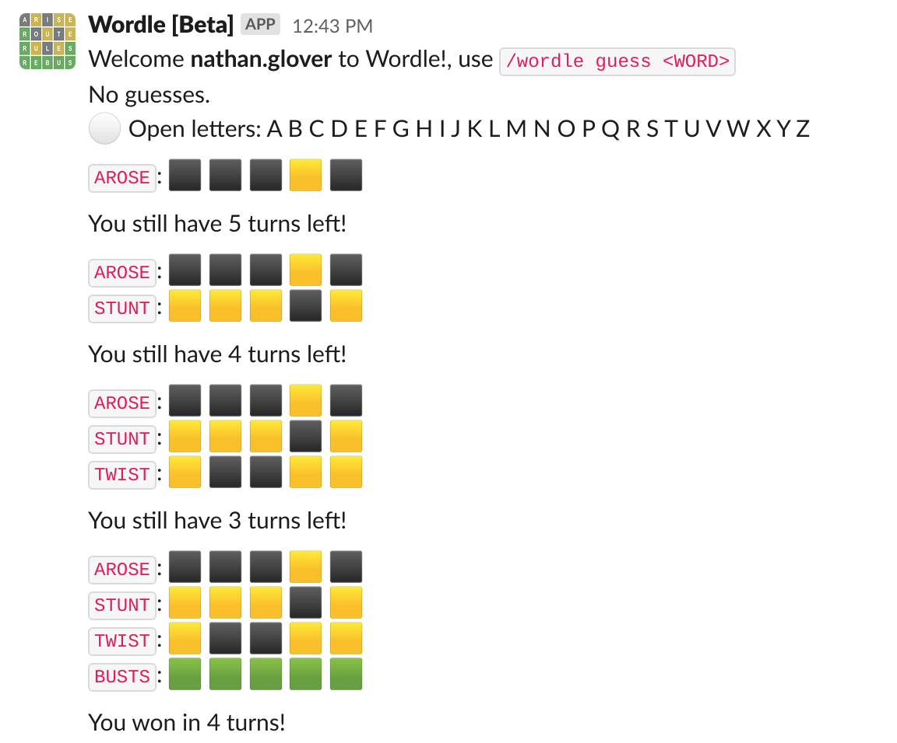

## Inspiration

Have you ever been bored in a meeting? Play Wordle instead!

At the start of 2022 the world was introduced to the Word game sensation Wordle. Since it exploded in popularity people have been posting their Wordle scores on social media and, more importantly they've been posting it in our office Slack.

Esspecially due to most of the office returning to a Work from home situation, it's been fantastic to have something to share with one-another daily.

This is when I had the idea to create a Slack app that let users play and share Wordle games in Slack!

## What it does

Slackbot Wordle generates Wordle games and lets users play whenever they want right within the Slack desktop or mobile client. It stores users game state, allowed them to pick up where they left off in the event that they get busy and can't complete the game at that moment.

Slackbot Wordle makes something that we all enjoy doing together and integrating it into the tool we already use daily, Slack.

## How I built it

I leveraged the following technologies to build Slackbot Wordle

* **Python** - Chosen language to write the project in
* **python-bolt (Slack SDK)** - SDK that I used to easily built out Slack app functionality quickly
* **AWS SAM** - Framework for deploying Cloud infrastructure to AWS.

Below is a simplified architecture diagram of how the solution works.

## Challenges I ran into

Displaying letters was a difficult problem to solve, as there wasn't native emojis for the english alphabet in the Slack client.

I played around with importing custom emojis however I knew this wasn't a long term solution given other slack orgs would have to import the same Slack emojis for it to work.

In the end I decided on using Markdown text to display the word next to each attempt

## Accomplishments that I'm proud of

I was really happy with the solution I came up with to store game state as without it, the game would have required the user to play all in one sitting. Storing and loading game state based on the users unique ID allowed me to create a game that was easy to picked whenever you had a free second

## What's next for Wordle Slackbot

I would like to develop a dynamic image generator for the Wordle game board rather then relying on text. I played around with some solutions to this problem already and have part of the game rendering, however I need to do more testing

I would also like to introduce a Leaderboard system, given that I keep a record of all our users games, it would be neat to provide statistics back to the user on how reguarly they are able to correctly guess the solution to the puzzles.
