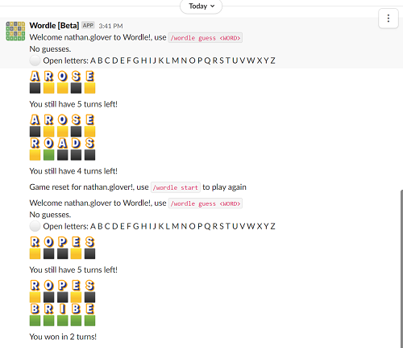
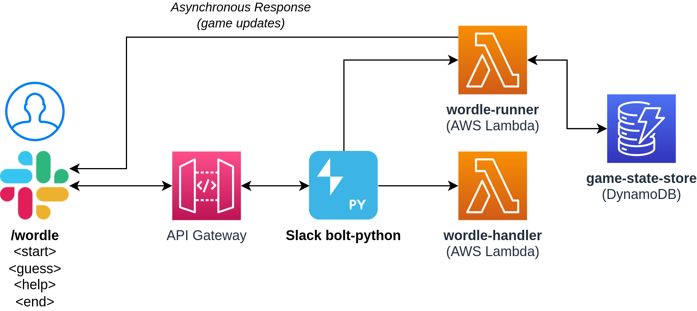

# Slackbot Wordle



## Usage

* `/wordle start` - start a game
* `/wordle guess <word>` - guess a 5 letter word
* `/wordle end` - terminate current active game (incase you want a new gameboard)
* `/wordle letters` - returns letters still available if a list helps you.

## Manual Deployment

```bash
# Install sam
pip install aws-sam-cli
## or
brew tap aws/tap && brew install aws-sam-cli

# Only needs to be run once (if a samconfig.toml file is not present in samconfig.toml)
sam deploy --guided

# Run each time
sam build
sam deploy
```

Follow the instructions in [SLACK.md](./SLACK.md) for details on how to install the bot in your workspace.

## Local Testing

### DynamoDB

```bash
# Start DynamoDB locally (must be run in devcontainer)
java -Djava.library.path=/opt/dynamodb_local/DynamoDBLocal_lib -jar /opt/dynamodb_local/DynamoDBLocal.jar -sharedDb
```

In a new terminal tab, run your tests

## GitHub Actions

Requires the [OIDC provider](.github/cfn/oidc-provider.yml) and [repository specific template](.github/cfn/oidc.yml) to be deployed into an AWS account allowing specific permissions needed.

Then make sure that the [following Secrets are setup for the repo](https://github.com/t04glovern/slackbot-wordle/settings/secrets/actions).

```bash
OIDC_ROLE_AWS_REGION
OIDC_ROLE_AWS_ROLE_TO_ASSUME
```

## Architecture



## TODO

* Convert flow to use [Surface modals if possible](https://api.slack.com/surfaces/modals/using) - will need to confirm this is possible with Slack Bolt
* Instead of returning Emojis/Unicode images, return a dynamically generated image (png/svg) that will be displayed in the modal.
  * i.e **URL**: `/gameboard/<some-kind-of-gameboard-encoding-in-url>/ -> image_data`

## Attribution

* [Building and deploying a Slack app with Python, Bolt, and AWS Amplify](https://www.xiegerts.com/post/slack-app-bolt-python-amplify/)
* [slack_bolt.app.app](https://slack.dev/bolt-python/api-docs/slack_bolt/app/app.html#slack_bolt.app.app.App)
* [Slack slash command responses](https://api.slack.com/interactivity/slash-commands#app_command_handling)
