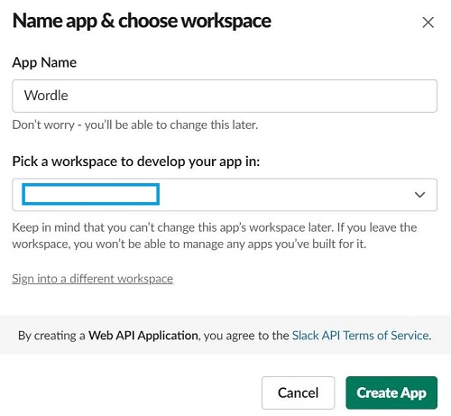
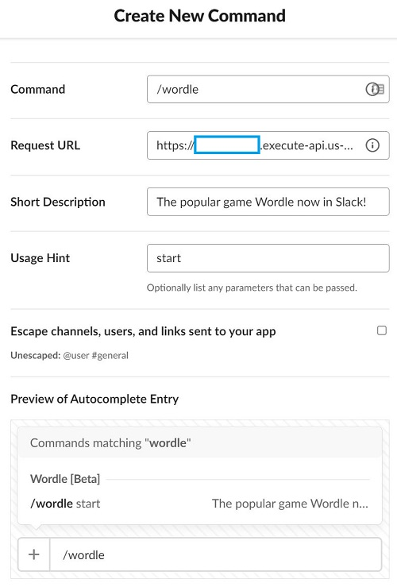

# Slack Setup

1. Nagivate to https://api.slack.com/apps and **Create new app** > **From scratch**. Give it a Name & Workspace

    

2. **Basic information** > **Add features & functionality** > **Slash commands**

    

3. Retrieve the following environment variables for use in the Lambda

    * `SLACK_SIGNING_SECRET`: **Basic information** > **App credentials**
    * `SLACK_BOT_TOKEN`: **OAuth & Permissions** > starts with `xoxo-`

4. Create secret

    ```bash
    aws secretsmanager create-secret \
        --name slackbot-wordle \
        --secret-string "{\"signing\":\"xxxxxxxxx\",\"token\": \"xoxb-xxxx\"\}"
    ```
